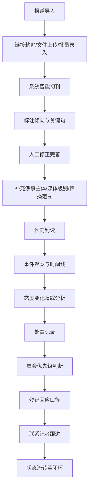

## 1. 产品概述

面向企业公关部的Web舆情研判台，帮助公关团队快速判断媒体报道对公司、品牌或高管的倾向，支持从报道导入、倾向判读到处置记录的全流程工作，提升舆情响应效率和决策质量。

- 核心价值：为公关团队提供标准化的舆情研判工具链，实现报道智能初判、态度变化追踪、处置全流程记录
- 目标用户：企业公关部专员、公关总监、品牌管理人员、危机公关负责人

## 2. 核心功能

### 2.1 用户角色

| 角色 | 注册方式 | 核心权限 |
|------|----------|----------|
| 公关专员 | 系统管理员分配 | 报道导入、倾向修正、处置登记 |
| 公关总监 | 系统管理员分配 | 全部功能、数据导出、审批处置方案 |

### 2.2 功能模块

1. **报道导入页**：链接粘贴导入、剪报图片上传、标题摘要批量录入、智能初判结果展示、关键句高亮标注
2. **倾向判读页**：事件时间线、媒体态度变化追踪、报道聚类分析、涉事主体标签、媒体级别与传播范围
3. **处置记录页**：回应口径管理、联系人信息、跟进状态追踪、晨会快速看板、升级预警机制

### 2.3 页面详情

| 页面名称 | 模块名称 | 功能描述 |
|----------|----------|----------|
| 报道导入 | 链接导入区 | 粘贴新闻URL，自动抓取标题、正文、发布时间 |
| 报道导入 | 文件上传区 | 支持PDF/图片格式剪报上传，OCR识别文本内容 |
| 报道导入 | 批量录入区 | 支持批量粘贴标题摘要，每行一条 |
| 报道导入 | 初判结果列表 | 展示正面/中性/负面/质疑/风险提示初判，高亮触发判断的关键句 |
| 报道导入 | 人工修正区 | 逐条修正倾向、补充涉事主体、媒体级别、传播范围 |
| 倾向判读 | 事件分组看板 | 按事件聚类展示相关报道组 |
| 倾向判读 | 时间线视图 | 按时间顺序展示首发到跟进报道的演化过程 |
| 倾向判读 | 态度变化分析 | 标注媒体态度转向（客观→追问、中立→批评等） |
| 倾向判读 | 声音来源识别 | 区分官方表态、监管声音、消费者反馈、专家评论 |
| 倾向判读 | 媒体矩阵 | 展示不同级别媒体（央媒/财经/门户/自媒体）的报道分布 |
| 处置记录 | 晨会看板 | 当日待处置事件卡片，快速判断优先级 |
| 处置记录 | 回应口径库 | 标准口径编辑、版本管理、审批状态 |
| 处置记录 | 联系人管理 | 记者联系方式、沟通记录、关系评级 |
| 处置记录 | 状态流转 | 待观察→已响应→已回应→已闭环的完整生命周期 |
| 处置记录 | 升级预警 | 触发升级条件时自动高亮（传播量/负面度/高管涉及） |

## 3. 核心流程

用户从报道导入开始，系统自动完成内容抓取与倾向初判；公关人员对初判结果进行修正完善，标注涉事主体与媒体信息；随后在倾向判读页按事件聚合追踪舆情演化，识别态度变化与风险信号；最终在处置记录页登记回应方案、联系记者、跟进状态，形成完整的舆情处置闭环。

## 4. 用户界面设计

### 4.1 设计风格

- 主色：深海军蓝 `#1e3a5f`（专业、稳重），辅助色：琥珀橙 `#f59e0b`（预警、行动），警示红 `#dc2626`（负面、风险），成功绿 `#059669`（正面、积极）
- 按钮风格：直角微圆角（2px），扁平设计，强调色按钮带细边框
- 字体：标题使用 "Noto Serif SC"（新闻编辑感），正文使用 "Noto Sans SC"（清晰易读），数据/编号使用 "JetBrains Mono"
- 布局风格：三栏式主工作台，左侧导航、中间主内容区、右侧详情抽屉；大量使用卡片分组、细边框分隔、紧凑信息密度
- 图标风格：Lucide线性图标，偏细线条（1.5px），保持专业克制

### 4.2 页面设计概览

| 页面名称 | 模块名称 | UI元素 |
|----------|----------|--------|
| 报道导入 | 顶部操作区 | Tab切换三种导入方式、导入统计数字、导入按钮 |
| 报道导入 | 初判列表 | 卡片式列表、倾向色标签、关键句黄色荧光标注、修正下拉选择器 |
| 倾向判读 | 时间线 | 左侧垂直时间轴、节点带媒体图标、态度变化用箭头+颜色渐变表示 |
| 倾向判读 | 事件看板 | 事件卡片聚合，悬停展开报道摘要、涉事主体标签 |
| 处置记录 | 晨会看板 | 四象限布局（紧急/重要矩阵）、预警卡片红色边框脉动动画 |
| 处置记录 | 口径编辑器 | 类文档编辑器、版本历史侧边栏、审批状态徽章 |

### 4.3 响应式

- Desktop-first 设计，主适用屏幕 1440×900 及以上
- 三栏布局在 1024px 以下折叠为两栏，右侧抽屉改为底部滑出
- 触控优化：表格行高、按钮点击区域不小于 44px

### 4.4 动效设计

- 页面加载：导航栏渐入 + 内容区卡片错峰淡入（staggered 80ms）
- 态度变化：颜色渐变过渡（800ms ease），箭头轻微滑动
- 预警卡片：低强度红色边框呼吸动画（2s 周期）
- 悬停反馈：卡片微提升（translateY -2px）+ 阴影增强
