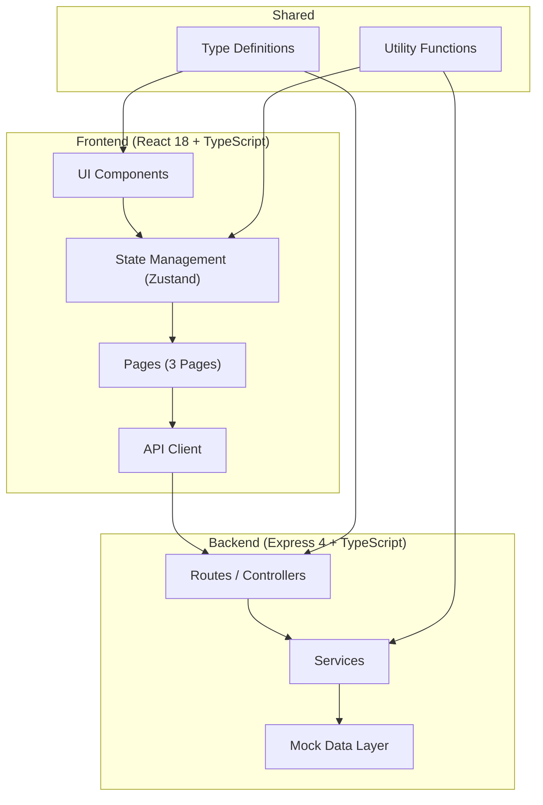
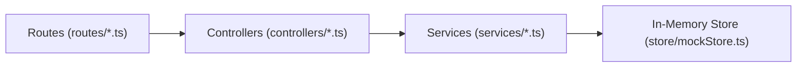
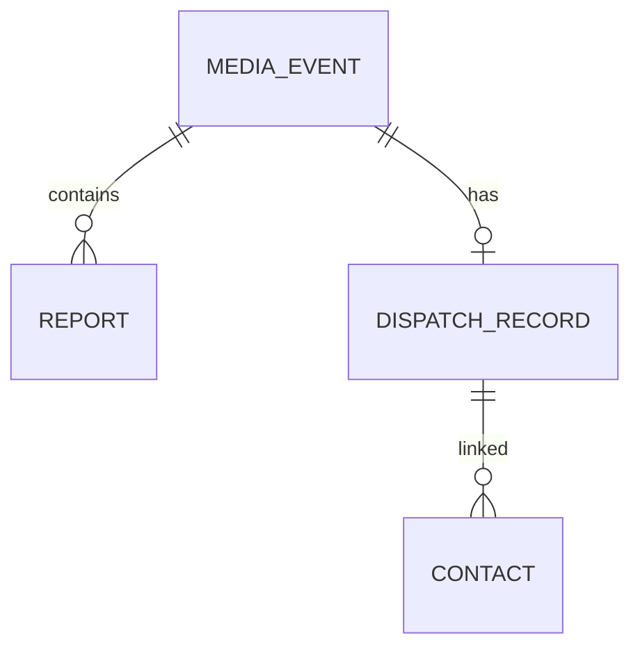

## 1. 架构设计



## 2. 技术说明

- 前端：React@18 + TypeScript + Vite + TailwindCSS@3 + Zustand + React Router DOM + Lucide React
- 初始化工具：vite-init (react-express-ts 模板)
- 后端：Express@4 + TypeScript (ESM)
- 数据层：前端 Mock 数据 + 内存存储，无需真实数据库，通过 Zustand store 管理应用状态
- 图标库：lucide-react

## 3. 路由定义

| 路由 | 用途 |
|------|------|
| / | 重定向至 /import |
| /import | 报道导入页 |
| /analysis | 倾向判读页 |
| /dispatch | 处置记录页 |

## 4. API 定义

### 4.1 类型定义

```typescript
// 报道倾向枚举
type SentimentType = 'positive' | 'neutral' | 'negative' | 'doubtful' | 'risk';

// 媒体级别枚举
type MediaLevel = 'national' | 'finance' | 'portal' | 'selfmedia' | 'industry';

// 传播范围
type ReachScope = 'local' | 'regional' | 'national' | 'viral';

// 处置状态
type DispatchStatus = 'pending' | 'responding' | 'responded' | 'closed';

// 关键句
interface KeySentence {
  id: string;
  text: string;
  reason: string;
  position: number;
}

// 报道
interface Report {
  id: string;
  title: string;
  summary?: string;
  content?: string;
  url?: string;
  source: 'url' | 'file' | 'manual';
  mediaName: string;
  mediaLevel: MediaLevel;
  publishTime: string;
  sentiment: SentimentType;
  originalSentiment: SentimentType;
  keySentences: KeySentence[];
  subjects: string[];
  reachScope: ReachScope;
  eventId?: string;
  createdAt: string;
}

// 事件
interface MediaEvent {
  id: string;
  name: string;
  reports: string[];
  firstReportTime: string;
  latestReportTime: string;
  sentimentShift: boolean;
  priority: 'low' | 'medium' | 'high' | 'critical';
}

// 处置记录
interface DispatchRecord {
  id: string;
  eventId: string;
  status: DispatchStatus;
  statement: string;
  contacts: Contact[];
  followUpNotes: string[];
  escalationLevel: 'normal' | 'manager' | 'director' | 'executive';
  createdAt: string;
  updatedAt: string;
}

// 联系人
interface Contact {
  id: string;
  name: string;
  media: string;
  title: string;
  phone: string;
  email: string;
  relationship: 'friendly' | 'neutral' | 'difficult';
  lastContact?: string;
}
```

### 4.2 接口列表

| 方法 | 路径 | 用途 |
|------|------|------|
| GET | /api/reports | 获取报道列表 |
| POST | /api/reports | 创建报道（导入） |
| PUT | /api/reports/:id | 更新报道信息（修正倾向等） |
| GET | /api/events | 获取事件列表 |
| GET | /api/events/:id | 获取事件详情及时间线 |
| GET | /api/dispatches | 获取处置记录列表 |
| POST | /api/dispatches | 创建处置记录 |
| PUT | /api/dispatches/:id | 更新处置状态/口径 |
| GET | /api/contacts | 获取联系人列表 |
| POST | /api/contacts | 添加联系人 |

## 5. 服务端架构图



## 6. 数据模型

### 6.1 数据关系图



### 6.2 数据说明

由于本项目使用内存 Mock 数据，无需真实 DDL。初始 Mock 数据将包含：
- 15-20 条示例报道，覆盖 4-5 个媒体事件
- 3-4 个事件，包含完整时间线
- 5-8 条处置记录示例
- 6-10 个联系人信息
